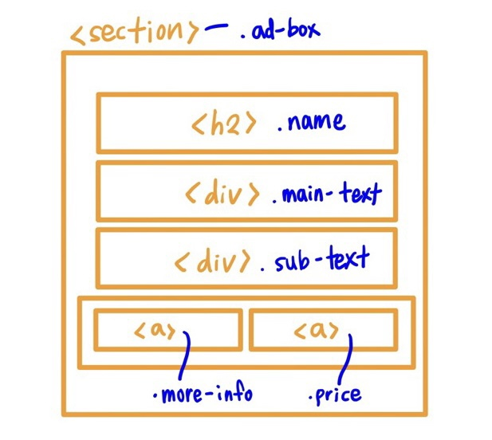

# 진행 순서
1. 작은 단위 컴포넌트 분리
2. 연관성에 따라 요소 묶기
3. 접근 순서
4. 접근 순서에 따른 마크업
5. 메인 카드 컴포넌트 css 구성
6. 컴포넌트 재사용 & 레이아웃 스타일링  
<br>

# 1. 작은 단위 컴포넌트 분리
* iPad Pro 페이지 기준 컴포넌트 분리<br>
(1) iPad Pro -> ```.name```     
(2) '놀라우리만치 얇다. 엄청나게 강력하다' -> ```.main-text```  
(3) '출시일 추후 공개' -> ```.sub-text```  
(4) '더 알아보기' -> ```<a>```  
<br>

# 2. 연관성에 따라 요소 묶기


# 3. 접근 순서 & 4. 접근순서에 따라 마크업
```h2``` -> ```.name``` -> ```.main-text``` -> ```.sub-text``` -> ```a``` 순서로 마크업했다.  
<br>  

# 5. 메인 카드 컴포넌트 css 스타일링
※ 배치
1. ```flex```를 통해 ```.ad-box```의 요소들인 ```.name, .main-text, .sub-text, <a>```를 column 방향으로 배치했고, ```gap```을 통해 각 요소들 간의 간격을 만들었다. 
2. ```<a>```로 감싼 ```'더 알아보기' 링크```와 ```'가격 보기' 링크``` 또한 ```flex```를 통해 ```row``` 방향으로 배치하여 둘 사이에 ```gap```을 주었다.

※ 스타일링  
-  ```기본 스타일링 -> 추가 스타일링``` 순서를 지키려고 노력했다.  
수업 중에 스스로 예제를 만들어 볼 때는, 공통적인 디자인을 고민하지 않고, 요소들마다 각각 코드를 짜려고 하다보니까 중복되는 코드들이 많았다.  
그래서 이번 과제에서는 특히 링크를 스타일링할 때, 먼저 ```<a>``` 태그에 ```더 알아보기``` 링크와 ```가격 보기``` 링크 모두에게 적용되는 공통적인 스타일링 코드를 작성하고, 그 안에 중첩패턴으로 ```'가격 보기'``` 링크의 코드를 작성했다. (배경색과 폰트색상이 달라졌다)


